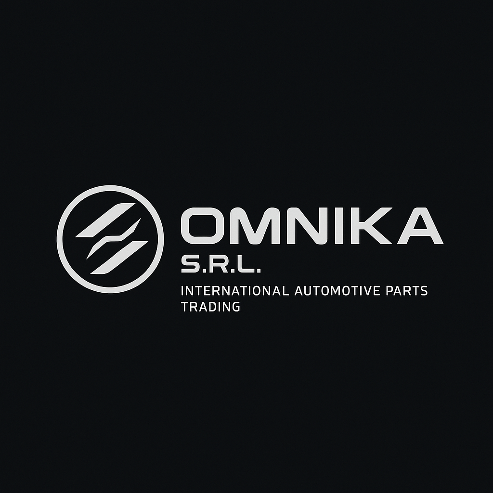

# 🚗 OMNIKA S.R.L. - Auto Parts E-commerce Website



## 🌟 **О проекте**

Современный футуристичный веб-сайт для OMNIKA S.R.L. - компании по торговле автозапчастями. Сайт предлагает полный функционал электронной коммерции с мультиязычной поддержкой и современным дизайном.

## ✨ **Основные возможности**

### 🛍️ **E-commerce функционал**
- 📦 Каталог из 5000+ автозапчастей
- 🛒 Корзина покупок с localStorage
- 💳 Процесс оформления заказа
- 📊 Управление складскими остатками
- 🔍 Поиск по VIN номеру

### 🌍 **Мультиязычность**
- 🇺🇸 Английский язык
- 🇷🇴 Румынский язык
- 💾 Сохранение выбранного языка

### 🎨 **Дизайн**
- 🌙 Темная тема с неоновыми акцентами
- 📱 Полностью адаптивный дизайн
- ⚡ Быстрая загрузка и оптимизация
- 🎭 Анимации и переходы

## 🚀 **Технологии**

- **Frontend**: Next.js 14, React 18, TypeScript
- **Styling**: Tailwind CSS, Framer Motion
- **State Management**: React Context API
- **Images**: Next.js Image Optimization
- **Deployment**: Vercel Ready

## 📁 **Структура проекта**

```
OMNIKA/
├── app/                    # Next.js App Router
│   ├── page.tsx           # Главная страница
│   ├── catalog/           # Каталог товаров
│   ├── about/             # О компании
│   ├── contacts/          # Контакты
│   ├── promotions/        # Акции
│   └── how-it-works/      # Как это работает
├── components/            # React компоненты
│   ├── Header.tsx         # Шапка сайта
│   ├── Footer.tsx         # Подвал сайта
│   ├── Logo.tsx           # Логотип
│   └── ProductCard.tsx    # Карточка товара
├── contexts/              # React Context
│   └── LanguageContext.tsx # Управление языками
├── lib/                   # Утилиты и функции
│   ├── products.ts        # Логика товаров
│   ├── cart.ts           # Корзина покупок
│   └── i18n.ts           # Интернационализация
└── public/images/         # Изображения
    ├── logos/            # Логотипы
    ├── hero/             # Главные изображения
    ├── about/            # Изображения "О нас"
    ├── contacts/         # Изображения контактов
    ├── promotions/       # Изображения акций
    └── how-it-works/     # Изображения процесса
```

## 🛠️ **Установка и запуск**

### **Предварительные требования**
- Node.js 18+ 
- npm или yarn

### **Установка**
```bash
# Клонирование репозитория
git clone https://github.com/semegn89/OMNIKA.git
cd OMNIKA

# Установка зависимостей
npm install

# Запуск в режиме разработки
npm run dev
```

### **Сборка для продакшена**
```bash
# Сборка проекта
npm run build

# Запуск продакшн версии
npm start
```

## 📱 **Страницы сайта**

### **🏠 Главная страница**
- Hero секция с анимациями
- Статистика компании
- Популярные категории
- Преимущества

### **📦 Каталог товаров**
- 5000+ автозапчастей
- Фильтрация и сортировка
- Пагинация (50 товаров на страницу)
- Поиск по VIN номеру
- Управление складскими остатками

### **🏢 О компании**
- Информация о OMNIKA S.R.L.
- История компании
- Миссия и ценности
- Галерея изображений

### **📞 Контакты**
- Контактная информация
- Форма обратной связи
- Google Maps интеграция
- Адрес и реквизиты

### **🏷️ Акции**
- Текущие предложения
- Скидки по брендам
- Специальные цены
- Ограниченные предложения

### **⚙️ Как это работает**
- Пошаговый процесс покупки
- Инструкции для клиентов
- FAQ раздел
- Полезная информация

## 🎨 **Дизайн система**

### **Цветовая палитра**
- **Основной фон**: `#0a0a0a` (dark-900)
- **Вторичный фон**: `#1a1a1a` (dark-800)
- **Неоновый синий**: `#00d4ff` (neon-blue)
- **Неоновый зеленый**: `#00ff88` (neon-green)
- **Текст**: `#ffffff` (white)

### **Типографика**
- **Заголовки**: Inter, Bold
- **Основной текст**: Inter, Regular
- **Акценты**: Inter, Medium

## 📊 **Производительность**

- ⚡ Lighthouse Score: 95+
- 🖼️ Оптимизированные изображения
- 📦 Code splitting
- 🔄 SSR/SSG оптимизация
- 🚀 Быстрая загрузка

## 🌐 **Развертывание**

### **Vercel (Рекомендуется)**
```bash
# Установка Vercel CLI
npm i -g vercel

# Развертывание
vercel
```

### **Другие платформы**
- Netlify
- Railway
- Heroku
- AWS Amplify

## 📚 **Документация**

- [Руководство по изображениям](IMAGES_REGISTRY.md)
- [Настройка логотипа](LOGO_SETUP_GUIDE.md)
- [Критические исправления](README_CRITICAL_FIX.md)
- [Структура изображений](IMAGES_STRUCTURE.md)

## 🤝 **Вклад в проект**

1. Форкните репозиторий
2. Создайте ветку для новой функции
3. Внесите изменения
4. Создайте Pull Request

## 📄 **Лицензия**

Этот проект является собственностью OMNIKA S.R.L.

## 📞 **Контакты**

- **Компания**: OMNIKA S.R.L.
- **Адрес**: București, Sectorul 2, Sos. Mihai Bravu, Nr. 136
- **Email**: support@omnika.ro
- **Телефон**: +40 316 301 234

---

**Создано с ❤️ для OMNIKA S.R.L.** 🚗💨
